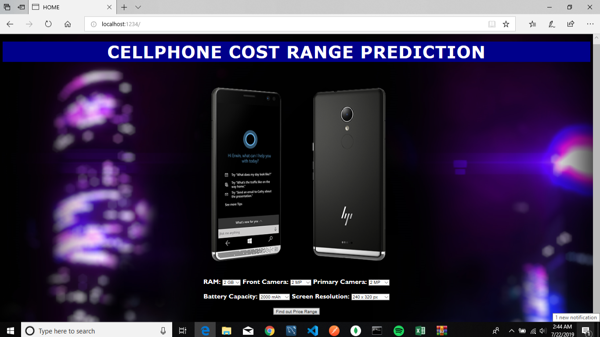
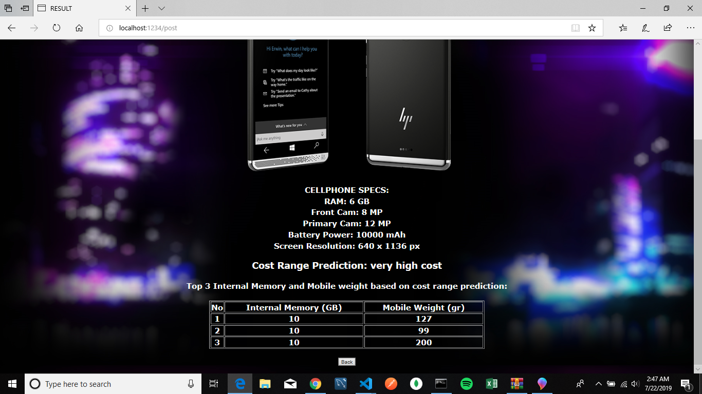

# Cellphone Cost Classification

The source of the dataset is from __["Mobile Price Classification"](https://www.kaggle.com/iabhishekofficial/mobile-price-classification/kernels)__ provided by Kaggle. 

## The case behind this dataset 

Bob has started his own mobile company. He wants to give tough fight to big companies like Apple,Samsung etc.

He does not know how to estimate price of mobiles his company creates. In this competitive mobile phone market you cannot simply assume things. To solve this problem he collects sales data of mobile phones of various companies.

Bob wants to find out some relation between features of a mobile phone(eg:- RAM,Internal Memory etc) and its selling price. But he is not so good at Machine Learning. So he needs your help to solve this problem.

In this problem you do not have to predict actual price but a price range indicating how high the price is

## Prediction

Before starting to predict, I compare 3 model machine learning: __Logistic Regression, Random Forest Classifier & K-Nearest Neighbors__ to find the best model for prediction. Since __KNN__ gives the best score among the others, the cellphone cost prediction will use __KNN__ for classifying the prediction. 

the features that will be used for prediction:
1. __RAM__
2. __Front Camera__
3. __Primary Camera__
4. __Battery Capacity__
5. __Screen Resolution__

In short, the cellphone cost classification system would be presented as below:

1. Home Page

    Before predicting, you should input on the features before hitting the prediction button as shown below:

    

2. Result Page

    The system will give the result of which classification of price based on the selected features.

    

    Besides that, the result also will show the top 3 of Internal Memory and Mobile weight features based on the cost prediction. 
    
    The top 3 of Internal Memory and Mobile Weight Features is recommended using __Content-Based Filtering__. This is to show the suitable of Internal Memory and Mobile Weight based on the cost range prediction.

    If you want to predict again, you can hit the 'back' button which will directly send you to the home page

3. Storing to MYSQL and MongoDB

   The desired cellphone specs along with the cost classification prediction and the suitable internal memory and mobile weight will be stored to MYSQL Database and MongoDB Database as below:

   MYSQL

   

   MongoDB

   

__KINDLY ENJOY IT :)__